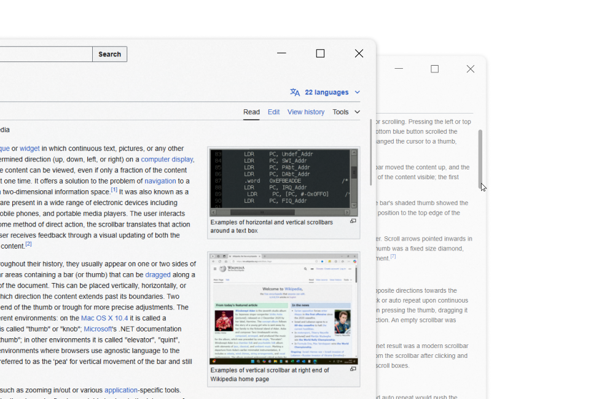

# Scrollbar Gui

A minimalist, modern, and lightweight React component for implementing custom 
scrollbars with a sleek and clean design. Perfect for projects that prioritize simplicity and elegance.

## View



## Features

- Minimalist and modern scrollbar design
- Clean UI without creating unwanted gaps or spaces
- Supports both X and Y axis scrollbars
- Lightweight and easy to implement
- Seamless integration with React applications
- Functionality for a clean UI
- Simple, elegant, and consistent across platforms
- Customizable to fit different design needs and preferences

## Usage

Below is a simple example of how to implement the `ScrollbarGui` component into your React app.

### Basic Example

1. **Install the package** via npm:

    ```bash
    npm install scrollbar-gui-react
    ```

2. **Import and Use the Component** in your React application:

    ```jsx
    import React from 'react';
    import ScrollbarGui from 'scrollbar-gui-react';  // Import the ScrollbarGui component

    const App = () => {
      return (
        <div style={{ width: '100%', height: '500px', overflow: 'hidden' }}>
          <ScrollbarGui>
            <div style={{ height: '2000px' }}>
              {/* Your content goes here */}
            </div>
          </ScrollbarGui>
        </div>
      );
    };

    export default App;
    ```

### Custom CSS Styling

You can customize the styles of the scrollbar by modifying the `scrollbar-gui-react` component. Here’s an example of custom styling:

```css
/* Custom CSS */
.scrollbar-gui .scrollbar {
  background-color: #d1d1d1;  
  border-radius: 10px;
}

.scrollbar-gui .thumb {
  background-color: #333;  /* Dark thumb color */
  border-radius: 5px;
  width: 12px;  /* Thicker scrollbar thumb */
}
