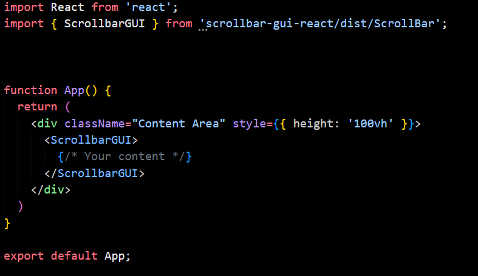
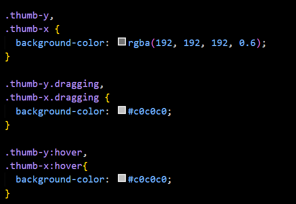

# Scrollbar Gui

A minimalist, modern, and lightweight React component for implementing custom 
scrollbars with a sleek and clean design. Perfect for projects that prioritize simplicity and elegance.

## View


## Features

- Minimalist and modern scrollbar design
- Clean UI without creating unwanted gaps or spaces
- Supports both X and Y axis scrollbars
- Lightweight and easy to implement
- Seamless integration with React applications
- Functionality for a clean UI
- Simple, elegant, and consistent across platforms
- Customizable to fit different design needs and preferences

## Usage



## Customize



## Installation

You can install the package via npm:

```bash
npm install scrollbar-gui-react


