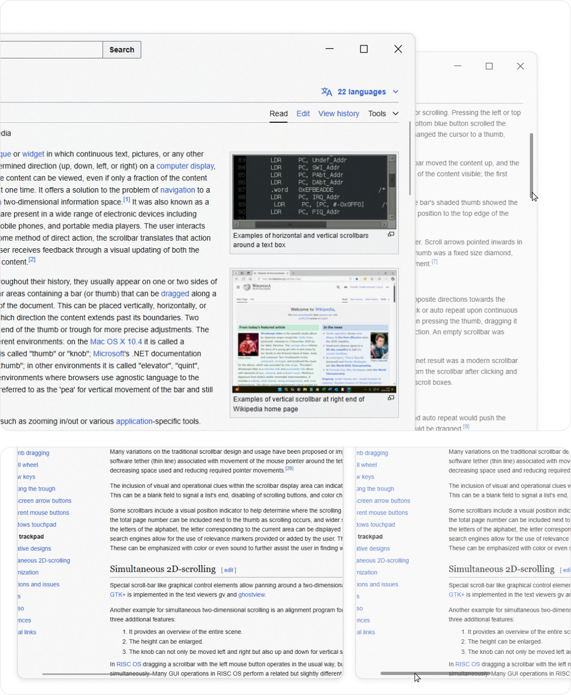

# Scrollbar Gui

A minimalist, modern, and lightweight React component for implementing custom 
scrollbars with a sleek and clean design. Perfect for projects that prioritize simplicity and elegance.

## View



## Features

- Minimalist and modern scrollbar design
- Clean UI without creating unwanted gaps or spaces
- Supports both X and Y axis scrollbars
- Lightweight and easy to implement
- Seamless integration with React applications
- Functionality for a clean UI
- Simple, elegant, and consistent across platforms
- Customizable to fit different design needs and preferences

## Usage

Below is a simple example of how to implement the `ScrollbarGui` component into your React app.

### Basic Example

1. **Install the package** via npm:

    ```bash
    npm install scrollbar-gui-react
    ```

2. **Import and Use the Component** in your React application:

    ```jsx
    import React from 'react';
    import ScrollbarGui from 'scrollbar-gui-react';  // Import the ScrollbarGui component

    const App = () => {
      return (
        <div style={{ width: '100%', height: '500px', overflow: 'hidden' }}>
          <ScrollbarGui>
            <div style={{ height: '2000px' }}>
              {/* Your content goes here */}
            </div>
          </ScrollbarGui>
        </div>
      );
    };

    export default App;
    ```

### Custom CSS Styling

You can customize the styles of the scrollbar by modifying the `scrollbar-gui-react` component. Here’s an example of custom styling:

```css
/* Custom CSS */
.thumb-y,
.thumb-x {
    background-color: rgba(192, 192, 192, 0.6);
}

.thumb-y.dragging,
.thumb-x.dragging {
    background-color: #c0c0c0;
}

.thumb-y.hover,
.thumb-x.hover {
    background-color: #c0c0c0;
}

/* Custom Spacing */
.thumb-x{
    margin-bottom: 5px; 
}
    
.thumb-y {
    margin-right: 5px;
}

/* Custom Height */
/* Scroll Area */
.scrollbar-x {
      height: 12px;
}
.scrollbar-y {
     width: 12px;
}

/* Scroll Unactive */
.thumb-x{
     height: 2px;
}
    
.thumb-y {
      width: 2px;
}

/* Scroll Active */
.scrollbar-y:hover .thumb-y,
.scrollbar-y.dragging .thumb-y,
.thumb-y:hover,
.thumb-y.dragging {
  width: 6px  ;

}

.scrollbar-x:hover .thumb-x,
.scrollbar-x.dragging .thumb-x,
.thumb-x:hover,
.thumb-x.dragging {
  height: 6px ;
}
